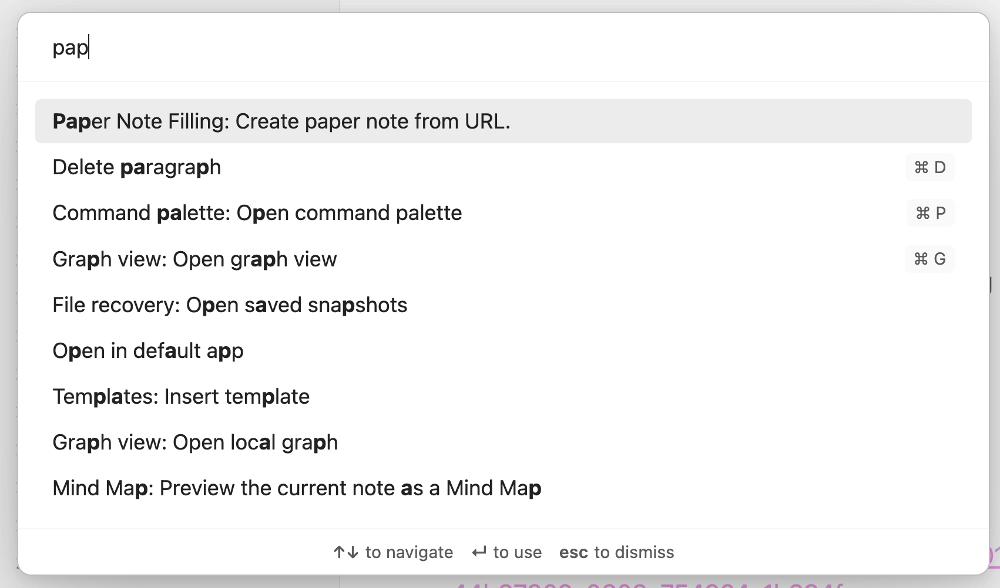
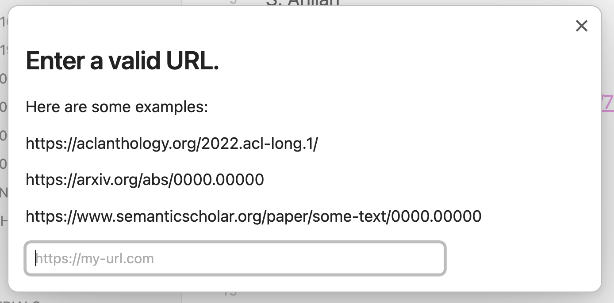
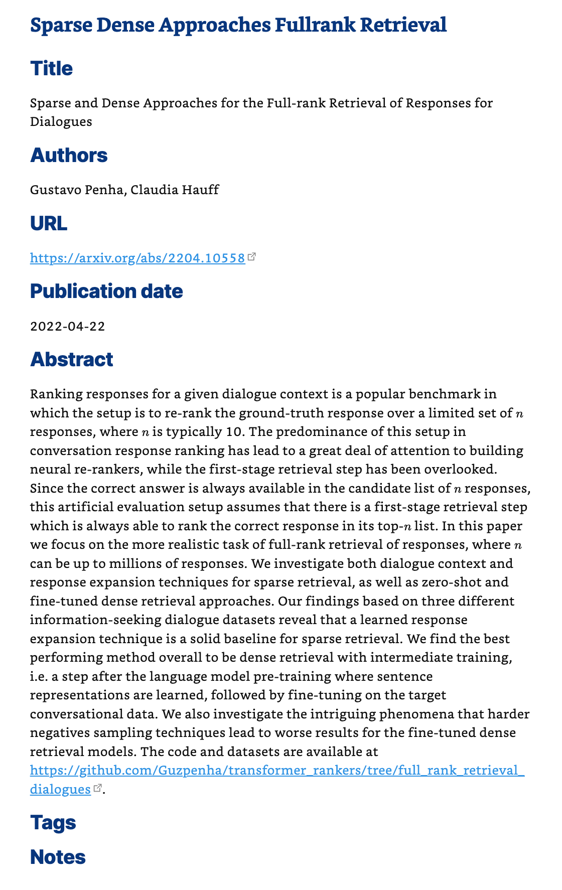

# arXiv URL to Obsidian Note

This plugin solves a single annoyance for me when it comes to taking notes about ML/NLP/IR papers - 90% of which happen to be available on [arxiv.org](https://arxiv.org/): the constant copy and paste to fill in a note template (author, title, etc.).

Instead of manually creating one [Obsidian](https://obsidian.md/) note per paper for a [zettelkasten](https://beingpax.medium.com/zettelkasten-method-with-obsidian-how-to-take-smart-notes-with-examples-cdaf348febbd), simply provide the URL and the plugin extracts the important information and creates a new note automatically.

This (mostly) works for paper URLs from three domains:

- arxiv.org, e.g. https://arxiv.org/abs/2111.13057 
- aclanthology, e.g. https://aclanthology.org/2022.acl-long.3/
- semantischolar, e.g. https://www.semanticscholar.org/paper/Feature-Engineering-for-Second-Language-Acquisition-Chen-Hauff/75033c495638dcb2fb8ebc6211e5e5e0e8b93ea6

If it is an arxiv paper, the ArXiv API is queried. The ACL Anthology isn't as simple to query, and since Semantic Scholar has most of the data ingested, the [Semantic Scholar API](https://www.semanticscholar.org/product/api) is queried with the respective aclanthology/semanticscholar identifier.

> **Note**
> This plugin was created in two evenings, it works but is brittle. Only tested on Desktop.

## Installing the plugin manually

> **Note**
> The plugin is not available via the Obsidian Hub as it takes quite a long time to get through the PR queue and the review process. This plugin is so niche and simple that it is not really worth it. So, manual installation it is.

1. Head to the vault folder (the following command assumes it is in the home directory in the `obsidian-vault` directory) and traverse into the plugin directory: `~/obsidian-vault/.obsidian/plugins/`.
2. Create a new directory called `paper-note-filler`.
3. Copy `main.js`, `styles.css`, `manifest.json` [from the latest release](https://github.com/chauff/paper-note-filler/releases/latest) to the just created directory. _This is all, the remaining files are not necessary._
4. Restart Obsidian.

_Ideally, this is it and the plugin is now installed._ A simple way to check this is to now open the settings tab of Obsidian. Everything worked if the `Paper Note Filling` plugin listed under Community Plugins. If not, check the `community-plugins.json` file in the `/plugins` folder and add the plugin name manually if necessary and then restart Obsidian one more time.

## Using the plugin

### Two settings

Open the settings tab of Obsidian. There should be the `Paper Note Filling` plugin listed under Community Plugins. There are two settings:

1. The folder in which to create all notes (any folder from inside the vault or the root folder itself).
2. The naming convention for each note (either using the respective identifier or the title of the paper).

### Creating a note

To create a note, open the command palette, and find the `Paper Note Filling:Create paper note from URL.`

Clicking the command brings up a dialogue in which to paste the URL:

Press <kbd>Enter</kbd> and a note with the paper title, authors, url, abstract, etc. should be created. If the file already exists, it will not be overwritten. The end result (here with the [Blue Topaz Obsidian theme](https://github.com/whyt-byte/Blue-Topaz_Obsidian-css)) looks something like this:

## Developing it further

Not hard as the plugin is straightforward and just a few hundred lines of code. Check out the instructions of the [Obsidian Sample Plugin repo](https://github.com/obsidianmd/obsidian-sample-plugin) to get started.
